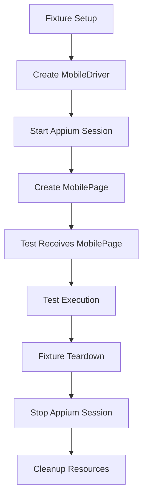
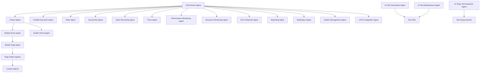

# Agents Documentation

This document describes the various agents and components that make up the Playwright + WebdriverIO + Appium mobile automation framework.

## Table of Contents

- [System Agents](#system-agents)
- [AI Assistant Agents](#ai-assistant-agents)
- [Test Execution Agents](#test-execution-agents)
- [Monitoring Agents](#monitoring-agents)
- [Integration Agents](#integration-agents)

---

## System Agents

### 1. Mobile Driver Agent

**File:** `mobile/MobileDriver.ts`

**Purpose:** Manages the Appium/WebdriverIO session lifecycle and device communication.

**Responsibilities:**
- Establishes connection to Appium server
- Creates and configures device sessions
- Manages session lifecycle (start/stop/cleanup)
- Handles device capabilities and configuration
- Provides error recovery mechanisms

**Key Methods:**
```typescript
- start(): Initialize Appium session
- stop(): Terminate session and cleanup
```

**Dependencies:**
- Appium Server (running on configured host:port)
- iOS Device/Simulator (connected and available)
- Xcode tools (for iOS device communication)

---

### 2. Mobile Page Agent

**File:** `mobile/MobilePage.ts`

**Purpose:** Provides Playwright-like abstraction layer for mobile element interactions.

**Responsibilities:**
- Element discovery and interaction
- Gesture support (swipe, tap, long press)
- Wait strategies and timeout management
- Context switching (native ↔ webview)
- Keyboard handling and input management
- XPath and selector resolution

**Key Capabilities:**
```typescript
- Element interactions: click, fill, text, visible, waitFor
- Gestures: swipeByPercent, swipeRightToLeft, hideKeyboard
- Context management: getContexts, setContext, switchToWebView
- Advanced waits: swipeUntilElementFound, waitForNotVisible
- XPath support: xpathExists, xpathCount, clickByXPath, textByXPath
```

**Design Pattern:** Abstraction Layer - hides WebdriverIO complexity

---

### 3. Fixture Agent

**File:** `mobile/fixtures.ts`

**Purpose:** Manages test lifecycle and dependency injection through Playwright fixtures.

**Responsibilities:**
- Test isolation (fresh session per test)
- Automatic setup/teardown
- Dependency injection of mobile page objects
- Resource management and cleanup
- Error handling and recovery

**Fixture Lifecycle:**


**Benefits:**
- Reusable across all tests
- Automatic cleanup guarantees
- Test isolation prevents flakiness
- Composable with other fixtures

---

### 4. Page Object Agents

**Files:**
- `mobile/pages/LoginPage.ts`
- `mobile/pages/ProductsPage.ts`

**Purpose:** Encapsulate page-specific interactions and business logic.

#### LoginPage Agent

**Responsibilities:**
- Login page verification
- User authentication flow with smart outcome detection
- Error message handling for iOS native alerts
- Login form interactions
- XPath-based popup dismissal for iOS alerts

**Key Methods:**
```typescript
- verifyLoginPage(): Validate page elements are present
- performLogin(username, password): Execute login flow with dynamic outcome detection
- verifyErrorAppear(header, text): Validate error popup
- clickOkButton(): Dismiss iOS native alert popup using XPath
- verifyErrorPopupDisappear(): Ensure popup is closed
```

**Recent Enhancements:**
- **Smart Login Handling**: `performLogin()` now dynamically detects login outcome by checking for error popups after a short wait. If no error appears, assumes successful login and waits for products page load.
- **XPath-Based Alert Handling**: `clickOkButton()` now uses XPath selectors (`'//XCUIElementTypeAlert//XCUIElementTypeButton[@name="OK"]'`) for reliable iOS native alert interaction, addressing the mismatch between simple accessibility IDs and iOS alert requirements.
- **Enhanced Error Detection**: Improved error popup visibility verification using `xpathExists()` method for more robust native alert handling.

#### ProductsPage Agent

**Responsibilities:**
- Product listing verification
- Product card validation
- Product data extraction
- Product detail comparison
- Price format validation

**Key Methods:**
```typescript
- verifyHeaderProductsAppear(): Verify products page header with enhanced timeout and fallback mechanisms
- verifyMultipleProductsDisplay(): Count and validate products
- verifyAllProductCards(): Validate all product cards
- verifyProductCardDetails(index): Validate specific product
- verifyProductItemDetails(index): Compare card vs detail data
- getDataFromCard(index): Extract product data from card
- getDataFromProductDetail(): Extract product data from detail page
```

**Recent Enhancements:**
- **Enhanced Header Verification**: `verifyHeaderProductsAppear()` now includes increased timeout (20s), fallback mechanisms for missing screen elements, and alternative XPath searches for improved element discovery reliability.
- **Automatic Debugging**: Automatic screenshot capture on verification failures to provide debugging context.
- **Improved Error Recovery**: Multiple fallback strategies for handling missing or slow-loading elements in dynamic iOS environments.

**Design Pattern:** Page Object Model - encapsulates page-specific logic

---

### 5. Locator Agents

**Files:**
- `mobile/locators/login-page.locators.ts`
- `mobile/locators/products-page.locators.ts`

**Purpose:** Centralize element selectors and provide type-safe locator management.

**Responsibilities:**
- Define element selectors
- Provide selector generation functions
- Support index-based selectors
- Maintain selector consistency across tests

**Features:**
- Type-safe selector definitions
- Constant and function-based locators
- Index-based selector generation for repeated elements
- XPath support for complex selectors
- iOS native alert handling using XPath selectors
- Mixed selector strategies (accessibility IDs for standard elements, XPath for native alerts)

**Example Usage:**
```typescript
// Simple locators
const usernameField = LoginPageLocators.usernameField

// Function-based locators with index
const productName = ProductsPageLocators.getProductName(0)
```

---

## AI Assistant Agents

### 1. Test Generation Agent

**Purpose:** Automated test case generation based on requirements and user stories.

**Capabilities:**
- Convert user stories to test scenarios
- Generate test data and edge cases
- Create test file structure
- Suggest appropriate assertions

**Example Workflow:**
```typescript
Input: "User should be able to login with valid credentials"
Output: 
  - Test case: Verify successful login
  - Test case: Verify redirect to dashboard
  - Test case: Verify session management
  - Test data: Valid credentials, edge cases
```

**Tools:** Natural language processing, requirement analysis

---

### 2. Test Maintenance Agent

**Purpose:** Automatically update tests when application changes are detected.

**Capabilities:**
- Detect broken locators
- Suggest selector updates
- Update page objects
- Identify deprecated test scenarios
- Refactor test code

**Triggers:**
- App version updates
- UI changes
- Test failures
- Locator detection failures

---

### 3. Flaky Test Detection Agent

**Purpose:** Identify and suggest fixes for flaky test scenarios.

**Capabilities:**
- Analyze test execution history
- Identify timing-related failures
- Suggest wait strategy improvements
- Recommend test isolation changes
- Detect race conditions

**Detection Methods:**
- Success rate analysis
- Timing variance detection
- Resource contention identification
- Environment dependency analysis

---

### 4. Test Data Generation Agent

**Purpose:** Generate realistic test data for various scenarios.

**Capabilities:**
- Create valid test credentials
- Generate product data
- Create edge case data
- Support data-driven testing
- Maintain data consistency

**Data Types:**
- User credentials (valid, invalid, edge cases)
- Product data (names, prices, descriptions)
- Form data (various input types)
- Boundary conditions

---

## Test Execution Agents

### 1. Test Runner Agent

**Purpose:** Orchestrate test execution and manage test lifecycle.

**Responsibilities:**
- Discover and organize tests
- Execute tests in configured mode
- Manage test dependencies
- Handle test retries
- Collect test results

**Execution Modes:**
- Parallel execution
- Sequential execution
- Debug mode
- Headed mode
- UI mode

**Configuration:** `playwright.config.ts`

---

### 2. Parallel Execution Agent

**Purpose:** Coordinate parallel test execution across multiple workers.

**Responsibilities:**
- Distribute tests across workers
- Manage worker lifecycle
- Collect results from workers
- Handle worker failures
- Balance test distribution

**Benefits:**
- Faster test execution
- Better resource utilization
- Scalability with test count

**Configuration:**
```typescript
workers: process.env.CI ? 1 : 1  // Mobile tests typically single-threaded
```

---

### 3. Retry Agent

**Purpose:** Handle test failures with intelligent retry strategies.

**Responsibilities:**
- Detect transient failures
- Execute retry logic
- Adjust retry parameters
- Track retry statistics
- Provide retry context in reports

**Retry Strategies:**
- Fixed retry count
- Exponential backoff
- Conditional retry based on error type

**Configuration:**
```typescript
retries: process.env.CI ? 2 : 0
```

---

### 4. Screenshot Agent

**Purpose:** Capture screenshots at strategic points during test execution.

**Responsibilities:**
- Capture screenshots on failures
- Capture screenshots on success (optional)
- Manage screenshot storage
- Include screenshots in reports
- Provide screenshot context

**Capture Points:**
- On test failure
- On test timeout
- On assertion failure
- Before/after critical interactions

**Configuration:**
```typescript
screenshot: 'only-on-failure'
```

---

### 5. Video Recording Agent

**Purpose:** Record test execution videos for debugging and documentation.

**Responsibilities:**
- Record test execution
- Manage video storage
- Include videos in reports
- Provide video playback interface
- Optimize video storage

**Recording Modes:**
- Retain on failure
- Always record
- Never record

**Configuration:**
```typescript
video: 'retain-on-failure'
```

---

### 6. Trace Agent

**Purpose:** Capture detailed execution traces for debugging.

**Responsibilities:**
- Record execution timeline
- Capture network requests
- Log console messages
- Track element interactions
- Provide timeline visualization

**Trace Contents:**
- Network requests/responses
- Console logs
- Element interactions
- Screenshot snapshots
- Timeline events

**Configuration:**
```typescript
trace: 'on-first-retry'
```

---

## Monitoring Agents

### 1. Health Check Agent

**Purpose:** Monitor system health before and during test execution.

**Responsibilities:**
- Check Appium server availability
- Verify device connectivity
- Validate app installation
- Monitor system resources
- Pre-flight checks

**Health Checks:**
```typescript
- Appium server reachable?
- Device connected and unlocked?
- App installed on device?
- Sufficient disk space?
- Network connectivity?
```

---

### 2. Performance Monitoring Agent

**Purpose:** Track performance metrics during test execution.

**Responsibilities:**
- Measure test execution time
- Track resource utilization
- Monitor memory usage
- Capture timing data
- Identify performance bottlenecks

**Metrics Collected:**
- Test duration
- Element wait times
- API response times
- Page load times
- Memory usage patterns

---

### 3. Resource Monitoring Agent

**Purpose:** Monitor system resource usage during test execution.

**Responsibilities:**
- Track CPU usage
- Monitor memory consumption
- Watch disk I/O
- Track network usage
- Alert on resource exhaustion

**Resource Alerts:**
- CPU usage > 90%
- Memory usage > 80%
- Disk space < 10%
- Network timeout

---

### 4. Error Detection Agent

**Purpose:** Detect and categorize errors during test execution.

**Responsibilities:**
- Identify error types
- Categorize failures
- Provide error context
- Suggest remediation
- Track error patterns

**Error Categories:**
- Locator errors (element not found)
- Timeout errors (wait exceeded)
- Device errors (connection lost)
- App errors (crash, ANR)
- Network errors (request failed)

---

## Integration Agents

### 1. CI/CD Integration Agent

**Purpose:** Integrate tests with continuous integration/continuous deployment pipelines.

**Responsibilities:**
- Execute tests in CI environment
- Report test results to CI systems
- Fail builds on test failures
- Provide test artifacts
- Integrate with deployment pipelines

**Supported CI Systems:**
- GitHub Actions
- Jenkins
- GitLab CI
- CircleCI
- Azure DevOps

**Integration Points:**
```yaml
# Example GitHub Actions integration
- name: Run Mobile Tests
  run: npm test
- name: Upload Test Results
  uses: actions/upload-artifact@v2
  with:
    name: test-results
    path: playwright-report/
```

---

### 2. Reporting Agent

**Purpose:** Generate and deliver test reports.

**Responsibilities:**
- Generate HTML reports
- Create JSON reports
- Generate console output
- Send email notifications
- Integrate with dashboard tools

**Report Types:**
```typescript
- HTML reports (rich, interactive)
- JSON reports (machine-readable)
- Console output (live feedback)
- Email summaries (notification)
- Dashboard integrations (visual)
```

**Configuration:**
```typescript
reporter: [
  ['html'],
  ['list'],
  ['json', { outputFile: 'test-results/results.json' }],
]
```

---

### 3. Notification Agent

**Purpose:** Send notifications based on test execution results.

**Responsibilities:**
- Send success notifications
- Alert on test failures
- Provide test summaries
- Include relevant context
- Support multiple channels

**Notification Channels:**
- Email
- Slack
- Microsoft Teams
- Discord
- Webhooks

**Notification Triggers:**
- All tests pass
- Any test fails
- Test suite completion
- Flaky test detection
- Performance degradation

---

### 4. Artifact Management Agent

**Purpose:** Manage test artifacts and provide access to historical data.

**Responsibilities:**
- Store test results
- Archive screenshots
- Manage video recordings
- Retain trace files
- Provide artifact retrieval

**Artifact Types:**
```typescript
- Test reports (HTML, JSON)
- Screenshots (failure screenshots)
- Videos (execution recordings)
- Traces (execution timeline)
- Logs (console output)
```

**Retention Policy:**
- Recent runs: 30 days
- Failed runs: 90 days
- Important runs: 1 year
- Archive: Compressed storage

---

## Agent Interaction Diagram



---

## Agent Configuration

### Environment Variables

```bash
# Appium Configuration
APPIUM_HOST=127.0.0.1
APPIUM_PORT=4730
APPIUM_PATH=/

# Device Configuration
APPIUM_PLATFORM_NAME=iOS
APPIUM_DEVICE_NAME=iPhone 17 pro
APPIUM_PLATFORM_VERSION=18.0
APPIUM_AUTOMATION_NAME=XCUITest
APPIUM_UDID=7B86896D-B6EE-4A4F-9E8D-05209FB2BB9F
APPIUM_BUNDLE_ID=com.example.MiniMarket

# App Configuration
APPIUM_APP_PATH=/path/to/app.app

# Agent Configuration
DEFAULT_TIMEOUT=15000
APP_TIMEOUT=60000
```

### Playwright Configuration

```typescript
// playwright.config.ts
export default defineConfig({
  testDir: './tests',
  fullyParallel: true,
  forbidOnly: !!process.env.CI,
  retries: process.env.CI ? 2 : 0,
  workers: process.env.CI ? 1 : 1,
  reporter: [
    ['html'],
    ['list'],
    ['json', { outputFile: 'test-results/results.json' }],
  ],
  use: {
    trace: 'on-first-retry',
    screenshot: 'only-on-failure',
    video: 'retain-on-failure',
  },
})
```

---

## Agent Development

### Creating New Agents

When adding new functionality, follow these guidelines:

1. **Single Responsibility**: Each agent should have one clear purpose
2. **Loose Coupling**: Agents should be independent and replaceable
3. **Clear Interfaces**: Define clear contracts between agents
4. **Error Handling**: Implement robust error handling and recovery
5. **Logging**: Provide comprehensive logging for debugging
6. **Testing**: Write tests for agent functionality

### Example: Custom Agent Template

```typescript
export class CustomAgent {
  constructor(private mobile: MobilePage) {}
  
  async performCustomAction(): Promise<void> {
    try {
      // Agent logic here
      console.log('Custom action started')
      
      // Perform action
      await this.mobile.waitFor('element_id')
      await this.mobile.click('element_id')
      
      console.log('Custom action completed')
    } catch (error) {
      console.error('Custom action failed:', error)
      throw error
    }
  }
  
  async validateCustomCondition(): Promise<boolean> {
    // Validation logic
    return await this.mobile.visible('validation_element')
  }
}
```

---

## Agent Best Practices

### 1. Error Handling

- Always implement try-catch blocks
- Provide meaningful error messages
- Include context in error logs
- Implement recovery mechanisms

### 2. Logging

- Use structured logging
- Include timestamps and context
- Log at appropriate levels (info, warn, error)
- Avoid logging sensitive data

### 3. Performance

- Optimize wait strategies
- Avoid unnecessary waits
- Use efficient selectors
- Cache frequently used elements

### 4. Maintainability

- Follow consistent naming conventions
- Document complex logic
- Keep methods focused and small
- Write comprehensive tests

### 5. Scalability

- Design for parallel execution
- Avoid shared mutable state
- Implement proper cleanup
- Use resource pooling

---

## Troubleshooting Agents

### Common Issues

**Agent Not Responding:**
- Check agent initialization
- Verify dependencies are available
- Review agent logs for errors
- Ensure proper configuration

**Agent Memory Leaks:**
- Monitor resource usage
- Implement proper cleanup
- Avoid circular references
- Use weak references where appropriate

**Agent Race Conditions:**
- Implement proper synchronization
- Use atomic operations
- Avoid shared state
- Design for idempotency

**Agent Timeouts:**
- Adjust timeout values
- Optimize agent performance
- Implement retry logic
- Use asynchronous patterns

---

## Future Agent Enhancements

### Planned Improvements

1. **AI-Powered Test Generation**: Use ML to generate test cases from user stories
2. **Visual Regression Agent**: Add visual comparison capabilities
3. **Performance Baseline Agent**: Track performance over time
4. **Cross-Browser Agent**: Extend support to multiple platforms
5. **API Testing Agent**: Integrate API testing with mobile tests
6. **Accessibility Agent**: Verify app accessibility compliance
7. **Security Agent**: Check for security vulnerabilities

### Integration Roadmap

- [ ] Add Android agent support
- [ ] Integrate with cloud testing platforms
- [ ] Add real device farm integration
- [ ] Implement test data management
- [ ] Add test suite optimization
- [ ] Integrate with defect tracking systems

---

## Agent Support and Maintenance

### Documentation

- Keep agent documentation updated
- Include usage examples
- Document configuration options
- Provide troubleshooting guides

### Testing

- Write comprehensive unit tests
- Implement integration tests
- Add performance tests
- Create edge case tests

### Monitoring

- Monitor agent health
- Track agent performance
- Collect agent metrics
- Implement alerting

---

## Conclusion

The agent-based architecture of this Playwright + WebdriverIO + Appium framework provides a robust, maintainable, and scalable solution for mobile automation. Each agent has a clear responsibility and well-defined interface, making the system easy to understand, extend, and maintain.

By following the best practices outlined in this document, you can ensure that your agents remain reliable, performant, and maintainable as your automation needs grow.

For questions or contributions related to agents, please refer to the project repository or contact the development team.