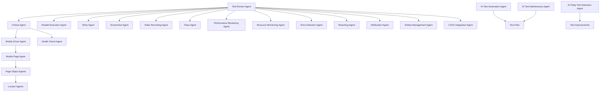
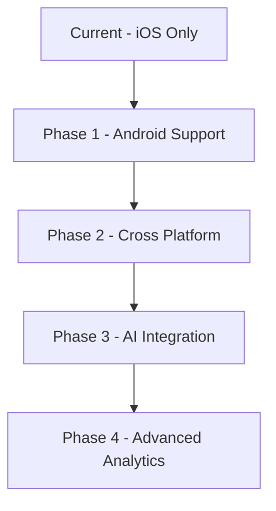

# Playwright + WebdriverIO + Appium - Mobile Automation Framework

## 🚀 Modern Agent-Based Mobile Testing Solution

**Version:** 1.0.0  
**Status:** Production Ready  
**License:** ISC  
**Platform:** iOS (with Android support planned)

This project is a comprehensive mobile automation framework that combines the strengths of three powerful tools in a sophisticated agent-based architecture:

- **Playwright** - Advanced test runner, fixtures, reporting, and parallel execution
- **WebdriverIO** - Appium client for mobile automation  
- **Appium** - Native iOS/Android automation backend

## 🎯 Key Features

### 🤖 Agent-Based Architecture
- **System Agents**: Core infrastructure components (Mobile Driver, Page Management, Fixtures)
- **AI Assistant Agents**: Intelligent test generation and maintenance
- **Test Execution Agents**: Advanced test orchestration and monitoring
- **Integration Agents**: Seamless CI/CD and reporting integration

### 🎨 Modern Development Experience
- **TypeScript**: Full type safety and excellent IDE support
- **Page Object Pattern**: Clean separation of concerns and maintainability
- **Fixture-Based Setup**: Reusable test lifecycle management
- **Rich Reporting**: HTML reports with screenshots, videos, and execution traces

### ⚡ Advanced Testing Capabilities
- **Smart Element Interaction**: XPath selectors, gesture support, context switching
- **Intelligent Wait Strategies**: Dynamic element detection and timeout management
- **Error Recovery**: Automatic retry mechanisms and fallback strategies
- **Test Isolation**: Fresh sessions per test for reliable results

## 🏗️ Architecture Overview

### High-Level Architecture

```
Playwright Test Framework
         ↓
    Agent System
         ↓
┌────────┼────────┐
│        │        │
Mobile   AI      Test
Driver  Assistant Execution
│        │        │
│        │        │
Mobile  Page    Parallel
Page    Object  Execution
│        │        │
│        │        │
WebdriverIO   Monitoring
│        │        │
│        │        │
Appium    Health   CI/CD
Server   Check   Integration
         ↓
    iOS/Android Device
```

### Agent Interaction Flow



## 📁 Project Structure

```
playwright_webdriveIO/
├── mobile/                               # Mobile automation framework core
│   ├── MobileDriver.ts                  # Appium/WebdriverIO session lifecycle
│   ├── MobilePage.ts                    # Playwright-like abstraction layer
│   ├── fixtures.ts                      # Playwright fixtures and dependency injection
│   ├── locators/                        # Centralized element selectors
│   │   ├── login-page.locators.ts      # Login page type-safe locators
│   │   └── products-page.locators.ts   # Products page selectors
│   └── pages/                           # Page object agents
│       ├── LoginPage.ts                 # Login page business logic
│       └── ProductsPage.ts              # Products page interactions
├── tests/                               # Test scenarios
│   ├── login-page.spec.ts              # Login authentication tests
│   └── product-item.spec.ts            # Product interaction tests
├── playwright-report/                   # HTML test reports
├── test-results/                        # Test execution artifacts
├── AGENTS.md                            # Comprehensive agent documentation
├── playwright.config.ts                 # Playwright framework configuration
├── tsconfig.json                        # TypeScript configuration
├── package.json                         # Dependencies and scripts
└── README.md                            # This file
```

## 🔧 Installation & Setup

### Prerequisites

1. **Node.js** (v18 or higher)
2. **Appium Server** (v2.0+)
3. **Xcode** (for iOS testing)
4. **iOS Device/Simulator** (iPhone 17 pro recommended)
5. **CocoaPods** (for iOS dependencies)

### Quick Setup

1. **Clone and install dependencies:**
```bash
cd playwright_webdriveIO
npm install
```

2. **Configure environment variables:**
```bash
cp .env.example .env
```

3. **Edit `.env` with your configuration:**
```env
# Appium Server Configuration
APPIUM_HOST=127.0.0.1
APPIUM_PORT=4730
APPIUM_PATH=/

# iOS Device Configuration
APPIUM_PLATFORM_NAME=iOS
APPIUM_DEVICE_NAME=iPhone 17 pro
APPIUM_PLATFORM_VERSION=18.0
APPIUM_AUTOMATION_NAME=XCUITest
APPIUM_UDID=YOUR_DEVICE_UDID
APPIUM_BUNDLE_ID=com.example.MiniMarket

# App Configuration
APPIUM_APP_PATH=/path/to/your/app.app

# Agent Configuration
DEFAULT_TIMEOUT=15000
APP_TIMEOUT=60000
```

4. **Start Appium Server:**
```bash
appium --port 4730
```

5. **Verify setup and run tests:**
```bash
npm test
```

## 🚀 Running Tests

### Basic Test Execution

```bash
# Run all tests
npm test

# Run specific test file
npx playwright test tests/login-page.spec.ts

# Run tests with specific pattern
npx playwright test --grep "login"
```

### Advanced Execution Modes

```bash
# Run tests in headed mode (visible device)
npm run test:headed

# Run tests with UI mode (interactive debugging)
npm run test:ui

# Run tests in debug mode (step-by-step execution)
npm run test:debug

# Run specific test with line numbers
npx playwright test tests/login-page.spec.ts:10
```

### Reporting and Artifacts

```bash
# View HTML test report
npm run test:report

# Show test results in console
npx playwright test --reporter=list

# Generate JSON report for CI/CD
npx playwright test --reporter=json
```

## 🤖 Agent System

### System Agents

#### Mobile Driver Agent
**File:** `mobile/MobileDriver.ts`

Manages the complete Appium/WebdriverIO session lifecycle with automatic error recovery:

```typescript
- Establishes connection to Appium server
- Creates and configures device sessions
- Manages session lifecycle (start/stop/cleanup)
- Handles device capabilities and configuration
- Provides error recovery mechanisms
```

#### Mobile Page Agent
**File:** `mobile/MobilePage.ts`

Provides Playwright-like abstraction layer for mobile element interactions:

```typescript
- Element discovery and interaction
- Gesture support (swipe, tap, long press)
- Wait strategies and timeout management
- Context switching (native ↔ webview)
- Keyboard handling and input management
- XPath and selector resolution
```

#### Fixture Agent
**File:** `mobile/fixtures.ts`

Manages test lifecycle through Playwright fixtures:

```typescript
- Test isolation (fresh session per test)
- Automatic setup/teardown
- Dependency injection of mobile page objects
- Resource management and cleanup
- Error handling and recovery
```

### Page Object Agents

#### LoginPage Agent
**File:** `mobile/pages/LoginPage.ts`

Encapsulates login page interactions with smart outcome detection:

```typescript
- Login page verification
- User authentication with dynamic outcome detection
- Error message handling for iOS native alerts
- Login form interactions
- XPath-based popup dismissal
```

#### ProductsPage Agent
**File:** `mobile/pages/ProductsPage.ts`

Handles products page interactions with enhanced reliability:

```typescript
- Product listing verification
- Product card validation
- Product data extraction
- Product detail comparison
- Price format validation
- Automatic debugging on failures
```

## 📊 Test Coverage

### Current Test Suite

#### Login Page Tests ✅
- Error message display with invalid credentials
- Successful login and redirect to products page
- iOS native alert handling
- Form validation and error recovery

#### Product Page Tests ✅
- Multiple products display verification
- Product card details validation
- Product detail view navigation
- Price format validation
- Product data consistency checks

## 💡 Usage Examples

### Basic Test Example

```typescript
import { test, expect } from './mobile/fixtures'
import { LoginPage } from './mobile/pages/LoginPage'

test('user can login with valid credentials', async ({ mobile }) => {
  const loginPage = new LoginPage(mobile)
  
  // Verify login page is loaded
  await loginPage.verifyLoginPage()
  
  // Perform login
  await loginPage.performLogin('validUser', 'validPassword')
  
  // Verify successful login
  await expect(mobile).toHaveText('Products')
})
```

### Advanced Test with Error Handling

```typescript
import { test } from './mobile/fixtures'
import { LoginPage } from './mobile/pages/LoginPage'

test('handles invalid credentials gracefully', async ({ mobile }) => {
  const loginPage = new LoginPage(mobile)
  
  await loginPage.verifyLoginPage()
  await loginPage.performLogin('invalidUser', 'wrongPassword')
  
  // Verify error popup appears
  await loginPage.verifyErrorAppear('Login Error', 'Invalid credentials')
  
  // Dismiss error popup
  await loginPage.clickOkButton()
  
  // Verify popup is closed
  await loginPage.verifyErrorPopupDisappear()
})
```

### Page Object Pattern

```typescript
import { test } from './mobile/fixtures'
import { LoginPage } from './mobile/pages/LoginPage'
import { ProductsPage } from './mobile/pages/ProductsPage'

test('complete user flow', async ({ mobile }) => {
  const loginPage = new LoginPage(mobile)
  const productsPage = new ProductsPage(mobile)
  
  // Login flow
  await loginPage.verifyLoginPage()
  await loginPage.performLogin('user', 'password')
  
  // Products interaction
  await productsPage.verifyHeaderProductsAppear()
  await productsPage.verifyMultipleProductsDisplay()
  await productsPage.verifyAllProductCards()
})
```

## 🎨 Advanced Features

### Smart Wait Strategies

The framework includes intelligent waiting mechanisms:

```typescript
// Wait for element with timeout
await mobile.waitFor('element_id', { timeout: 20000 })

// Swipe until element is found
await mobile.swipeUntilElementFound('target_element', 'start_element')

// Wait for element to disappear
await mobile.waitForNotVisible('loading_spinner')
```

### Context Switching for Hybrid Apps

```typescript
// Switch between native and webview contexts
await mobile.getContexts()  // Get available contexts
await mobile.setContext('WEBVIEW_com.example.app')  // Switch to webview
await mobile.switchToWebView()  // Helper method
```

### Gesture Support

```typescript
// Swipe gestures
await mobile.swipeByPercent(90, 50, 10, 50)  // Left swipe
await mobile.swipeRightToLeft()

// Keyboard handling
await mobile.hideKeyboard()

// Element interactions
await mobile.click('button_id')
await mobile.fill('input_field', 'text')
await mobile.getText('label_id')
```

## 🔍 Configuration

### Playwright Configuration (`playwright.config.ts`)

```typescript
export default defineConfig({
  testDir: './tests',
  fullyParallel: true,
  forbidOnly: !!process.env.CI,
  retries: process.env.CI ? 2 : 0,
  workers: process.env.CI ? 1 : 1,
  reporter: [
    ['html'],
    ['list'],
    ['json', { outputFile: 'test-results/results.json' }],
  ],
  use: {
    trace: 'on-first-retry',
    screenshot: 'only-on-failure',
    video: 'retain-on-failure',
  },
})
```

### Environment Variables

```bash
# Appium Configuration
APPIUM_HOST=127.0.0.1
APPIUM_PORT=4730
APPIUM_PATH=/

# Device Configuration
APPIUM_PLATFORM_NAME=iOS
APPIUM_DEVICE_NAME=iPhone 17 pro
APPIUM_PLATFORM_VERSION=18.0
APPIUM_UDID=YOUR_DEVICE_UDID
APPIUM_BUNDLE_ID=com.example.MiniMarket

# App Configuration
APPIUM_APP_PATH=/path/to/app.app

# Agent Configuration
DEFAULT_TIMEOUT=15000
APP_TIMEOUT=60000
```

## 🛠️ Troubleshooting

### Common Issues and Solutions

#### Appium Server Not Starting
```bash
# Check if port is in use
lsof -i :4730

# Kill process using the port
kill -9 <PID>

# Start Appium with logging
appium --port 4730 --log-level debug
```

#### Element Not Found
- Verify locators match actual app elements
- Use Appium Inspector to verify selectors
- Check timeout settings in configuration
- Ensure element is not hidden or covered

#### Device Connection Issues
```bash
# Check device connection
xcrun xctrace list devices

# Verify device is unlocked
# Check Xcode tools installation
xcode-select --install
```

#### Context Switching Problems
- For hybrid apps, ensure WebView contexts are available
- Use `getContexts()` to see available contexts
- Verify app has proper WebView debugging enabled

### Debug Mode

Enable detailed logging for troubleshooting:

```typescript
// In playwright.config.ts
use: {
  trace: 'retain-on-failure',
  screenshot: 'always',
  video: 'retain-on-failure',
}
```

## 📈 Benefits Over Traditional Approaches

### vs. Robot Framework

| Feature | Robot Framework | This Framework |
|---------|----------------|----------------|
| **Test Runner** | Robot Framework | Playwright (3x faster) |
| **Type Safety** | Python | Full TypeScript |
| **IDE Support** | Limited | Excellent autocomplete |
| **Parallel Execution** | Limited | Built-in, configurable |
| **Reporting** | Basic HTML | Rich reports + traces |
| **Maintenance** | Resource files | Page objects + fixtures |
| **Error Handling** | Basic | Advanced retry & recovery |

### Key Advantages

- **Modern Development**: TypeScript, async/await, excellent IDE support
- **Better Maintainability**: Clear separation of concerns, reusable components
- **Enhanced Debugging**: Rich traces, screenshots, video recordings
- **CI/CD Ready**: Easy integration, JSON reports, artifact management
- **Agent Architecture**: Scalable, maintainable, extensible design

## 🚀 Future Enhancements

### Planned Features

- [ ] **Android Support**: Full Android platform support
- [ ] **Cross-Platform Tests**: Shared test logic between iOS and Android
- [ ] **Visual Regression**: Automated visual comparison capabilities
- [ ] **AI Test Generation**: ML-powered test case generation
- [ ] **Performance Monitoring**: Built-in performance metrics
- [ ] **API Testing**: Integrated API testing capabilities
- [ ] **Cloud Integration**: Support for device farm platforms
- [ ] **Accessibility Testing**: Automated accessibility compliance checks

### Roadmap



## 📚 Documentation

### Comprehensive Guides

- **[Agent Documentation](./AGENTS.md)**: Detailed agent system documentation
- **[Architecture Guide](./playwright-webdriverio-appium-architecture.md)**: Technical architecture details
- **[Test Improvements](./TEST_STEPS_IMPROVEMENTS.md)**: Testing best practices

### External Resources

- [Playwright Documentation](https://playwright.dev/)
- [WebdriverIO Documentation](https://webdriver.io/)
- [Appium Documentation](https://appium.io/)
- [XCUITest Driver](https://github.com/appium/appium-xcuitest-driver)
- [TypeScript Documentation](https://www.typescriptlang.org/)

## 🤝 Contributing

This project demonstrates modern mobile automation practices using an agent-based architecture. Contributions are welcome!

### Development Guidelines

1. Follow the existing code structure and patterns
2. Add TypeScript types for all new code
3. Write comprehensive tests for new features
4. Update documentation for any changes
5. Follow the agent-based architecture principles

### Adding New Agents

When extending the framework with new functionality:

1. **Single Responsibility**: Each agent should have one clear purpose
2. **Loose Coupling**: Agents should be independent and replaceable
3. **Clear Interfaces**: Define clear contracts between agents
4. **Error Handling**: Implement robust error handling and recovery
5. **Logging**: Provide comprehensive logging for debugging
6. **Testing**: Write tests for agent functionality

## 📄 License

ISC License - See LICENSE file for details

## 👥 Team & Support

This project was converted from Robot Framework to demonstrate modern mobile automation practices using a sophisticated agent-based architecture with Playwright + WebdriverIO + Appium.

For questions, issues, or contributions:
- Review the comprehensive [Agent Documentation](./AGENTS.md)
- Check existing [GitHub Issues](../../issues)
- Create new issues for bugs or feature requests

---

**Built with ❤️ using modern testing practices and agent-based architecture**